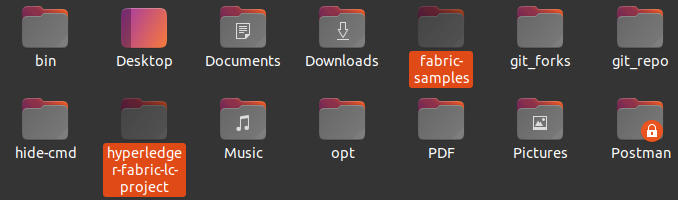
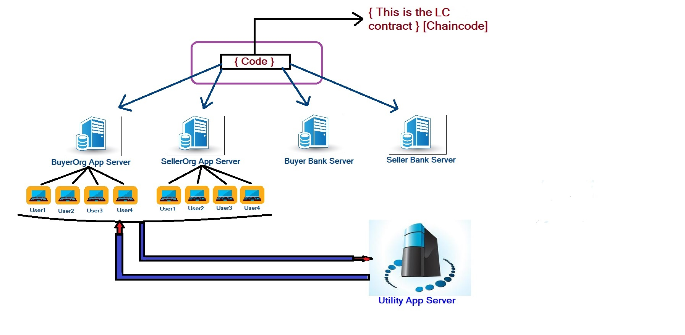

# hyperledger-fabric-lc-project

### This project is based on Hyperledger Fabric 2.2.1 
### Prerequisites :
* Docker
* Docker Compose
* Fabric 2.2.1
* Node js  (LTS)
* Internet Connection (cloud database)

---
### Basic Structure : 
### There are 4 organizations :
* Org1(Buyers)
* Org2(Sellers)
* Org3(Buyers Bank)
* Org4(Sellers Bank)

Fabric 2.2.1 test network only makes 2/3 orgs .  
So we edited the test network scripts for creating 5 orgs.  
For this project we will use only 4 orgs .

---
---

---
# How To Run It ?

you need to install pm2 module globally in node js  

```bash
    npm install pm2 -g
```

now , clone our github repo in the same directory where your fabric-samples folder is located .

```bash
    git clone https://github.com/Sumon2017/hyperledger-fabric-lc-project.git
```

Note : hyperledger-fabric-lc-project and fabric-samples should be on same directory (see the pic)



open up a terminal in ***hyperledger-fabric-lc-project/onoff***  

now , from **onoff** directory give excecute permission to our scripts  

```bash
    chmod 777 ./on.sh
    chmod 777 ./off.sh
```

now from **onoff** directory to satrt the program run :

```bash
    ./on.sh
```

cautious : you have to be in **onoff** directory

this will take between 10-15 minutes depending on your hardware and internet speed  

this will create the fabric network (creating channel, installing chaincode) and 5 node js servers  (you can see them by [docker ps -a] and [pm2 list]  )  
At the end of it , success will be printed  


To stop it  , run :  

```bash
    ./off.sh
```

cautious : you have to be in **onoff** directory  
At the end of it , success will be printed  

  
## Now , Open your browser and make 4 new tabs . And hit the following links :  

localhost:3001/index.html  
localhost:3002/index.html  
localhost:3003/index.html  
localhost:3004/index.html  

These are BuyersOrgApp , SellersOrgApp , BuyersBank and SellersBank accordingly.  
  
   


You will find some crypto materials in this project but these will get overriten with new valid crypto materials .  

---
# User Manual :
* Step 1 : sign up in sellersorgapp and buyersorgapp . You will get your verification code in your email .  
if you dont find it , check spam folder . Then verify with it . (if you dont want to do this we will give two premade accounts for login)  
* Step 2 : login for sellersorgapp and buyersorgapp  
* Step 3 : from sellersorgapp create an lc and get your pub_key and sign (with hex string secret)  
* Step 4 : create lc from sellersorgapp  
* Step 5 : from buyersorgapp check notifications for the lc id and approve with your sign .
* Step 6 : from buyersbank check notifications and issue the lc  
* Step 7 : from sellersbank check notifications and send shipment details . (this should be a string)  
* Step 8 : from buyersbank check notifications and send transaction money payment details . (this should also be a string) this is the last step and all is done .  

Tips : use dummy strings in shipment details and transaction details for testing perpose . You can also corrupt sign by changing data(after getting pub_key and sign in step 3) and see if buyer / buyers bank takes it .  


### **premade accounts** : 
---

| SellersOrgApp        | BuyersOrgApp           |
| ------------- |:-------------:|
|username : sumon|username : tuhin|
|zksumon2017@disbox.org|tuhin123@disbox.org|
|pass : 1234|pass : 1234|
---


## Note: All account related information (not secret hex string ) like  notification list , account , email , password (hashed with bcrypt library) is stored on mongodb Cloud Database , your login session is managed by jsonwebtoken and browser cookies (1h expire time)

---


# LC Rules : 
* only seller will initiate the lc  
* buyer will aprrove LC pointed towards it , if everithing is ok with the lc and sellers sign  
* buyers bank will issue lc after checking both buyer and seller sign
* all sign verification is done inside the chaincode (not server)  
* buyers can verify and sign only if the lc_status is initial  
* buyers bank can verify and issue lc only if the lc_status is aproved  
* sellers bank can send shipment details only if the lc _status is issued  
* buyers bank can send transaction details only if the lc_status is shipped  
* everything should be under lc_expire time  


---


# Chaincode API Access Control :

we made all of the 4 node js servers . there isn't any function in them which should not be their . Example : seller should not be able to invoke buyers bank verify function . Even if we implement this kind of function in server  it will get rejected on the chaincode . Because we are checking the fabric MSP ID in all functions . if there is a contradiction the functions will immediately return without heading further .

# Architectural Overview



As you can see above , the 4 orgs created channel and installed chaincode . First two node js servers can have many users .  
Though Buyers & Sellers Org are like a centralized entity , they can never get the users hex secret string which is used for creating private-public key pair . Users hex secret string never goes through the 4 org node js servers . All users will use an utility server for sending all payload (lc details) and secret hex string and getting pub key string and sign . This utility service can also be implemented in complex frontend app or users own managed server .  

In real world situations users just have to prove that they are the real owner of the public keys mentioned in the ledger and that's very easy .

---


# NoSql Cloud Database
All servers (except the utility) are connected to their own mongodb cloud databases . So , when testing there should be internet connection . We gave all server secrets , email service secrets and mongodb uri in .env files , So it will work fine .

# API Documentation  
api documentations is given in docs folder . So you can also check these without UI .

---


# Notification System Flow :
When buyersbank or sellersbank does something , it notifies all other 3 servers and the servers save them in cloud database .  
when seller makes an LC , it notiifies Buyers Organization (all saved in cloud).  
when buyer approves an LC , it notiifies Buyers Bank (all saved in cloud).


---

# We already tested with the following two accounts .  
# You can check results by logging in :

| SellersOrgApp        | BuyersOrgApp           |
| ------------- |:-------------:|
|username : testseller|username : testbuyer|
|testseller@disbox.org|testbuyer@disbox.org|
|pass : 1234|pass : 1234|


---


# Hashing Algorithms :
For all the signing and sign verification we use node js **elliptic** library  
We are using **elliptic\'s** **EDDSA** algorithm .  
And for curve selection we used **ed25519** which is considered to be a very secure curve .  
On lc we are giving unique lc id based on product details string hash\'s first 8 characters . And this hash is done by **crypto** library's **md5** hashing .  
For password hashing and verifying we used **bcrypt** library  
